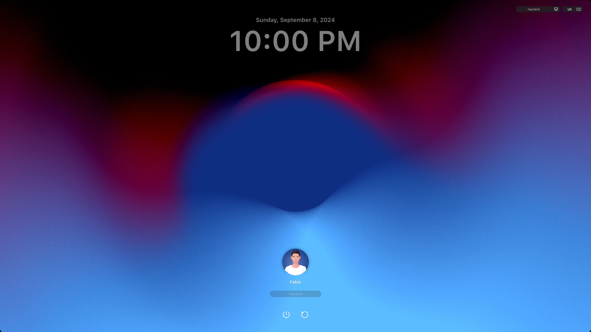
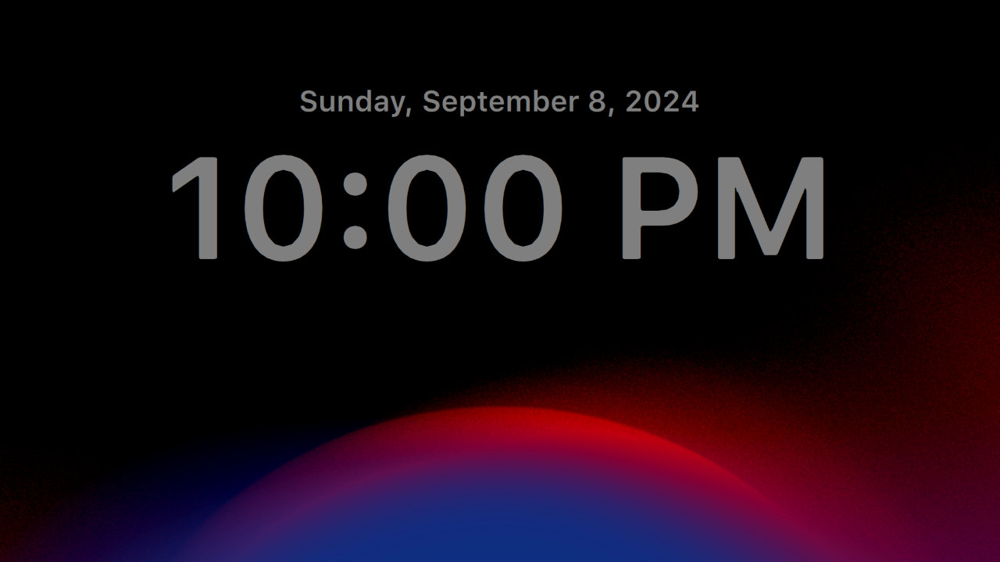
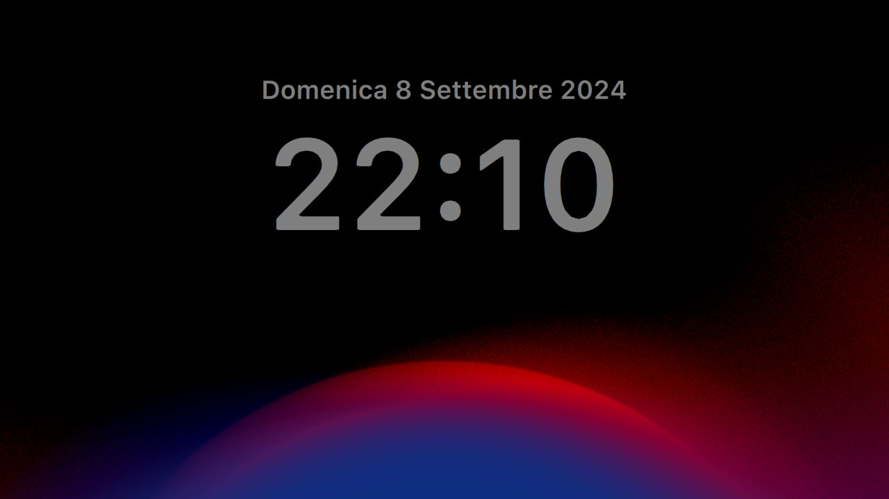
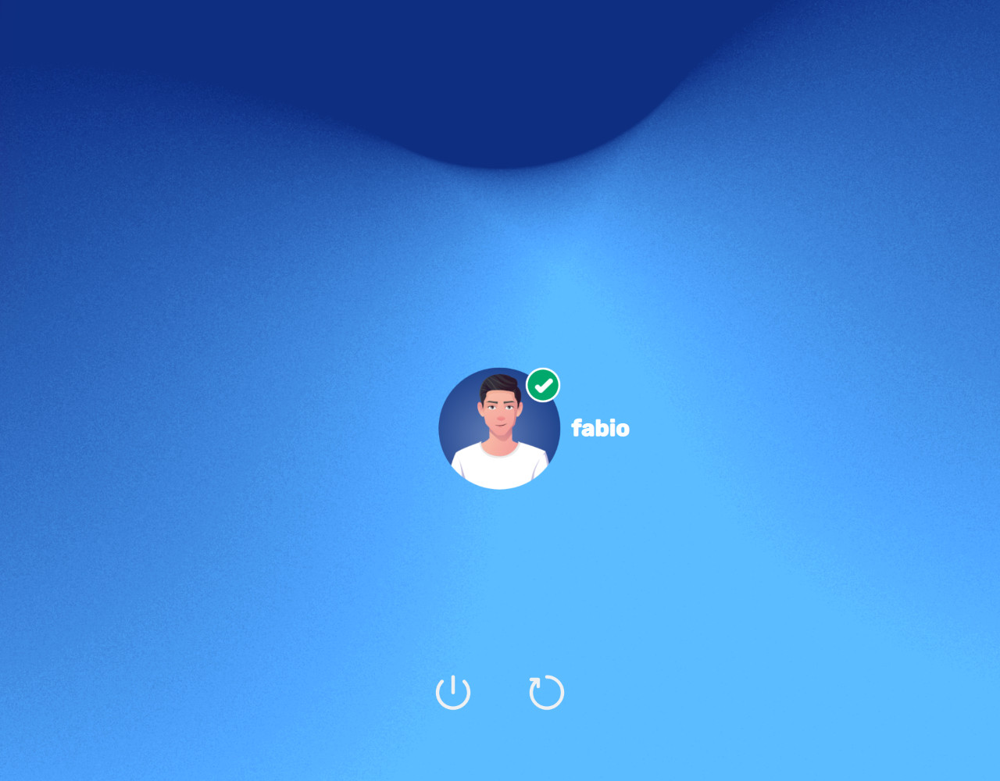
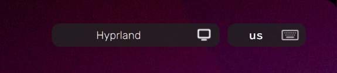
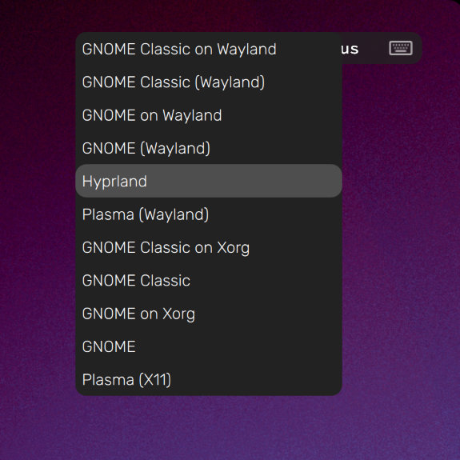

# Minimal SDDM Login Theme 🎨



A simple yet good looking login theme for sddm with **automatic language and locale support** based on your operating system and **multi user and session** selection built in.

## Features 📖

### Automatic locale and language support 🗺️

This depends on your `/etc/locale.conf` configuration, see [change locale](#4-change-system-locale-️-optional) section below.

| English (US) | Italian |
|-----|-----|
|  |  |

### User selection 👤

By clicking on the user icon you can open the multi user selection menu



### Session selection 🖥️

On the top right corner you can find your current keyboard layout and a drop down menu of all your available sessions





## Setup ⚙️

### 0. Dependencies 📦

This theme requires **SDDM 0.21 or newer** built with Qt6 support, plus the Qt6 QML runtime modules used by the theme:

| QML module | Used for |
|-----|-----|
| `QtQuick`, `QtQuick.Controls`, `QtQuick.Layouts` | UI components |
| `Qt5Compat.GraphicalEffects` | blur, shadows and avatar mask effects |
| `QtQuick.VirtualKeyboard` *(optional)* | on-screen keyboard |

**Arch / CachyOS:**

```sh
sudo pacman -S sddm qt6-declarative qt6-5compat
# optional on-screen keyboard
sudo pacman -S qt6-virtualkeyboard
```

**Debian / Ubuntu:**

```sh
sudo apt install sddm qml6-module-qtquick-controls qml6-module-qtquick-layouts qml6-module-qt5compat-graphicaleffects
# optional on-screen keyboard
sudo apt install qml6-module-qtquick-virtualkeyboard
```

**Fedora:**

```sh
sudo dnf install sddm qt6-qtquickcontrols2 qt6-qt5compat
# optional on-screen keyboard
sudo dnf install qt6-qtvirtualkeyboard
```

**openSUSE:**

```sh
sudo zypper install sddm qt6-declarative-imports qt6-qt5compat-imports
# optional on-screen keyboard
sudo zypper install qt6-virtualkeyboard-imports
```

### 1. Download ⬇️

> [!IMPORTANT]
> You have to run the following command with `sudo` privileges

```sh
wget https://github.com/fabio-garavini/minimal-sddm-login-theme/archive/refs/heads/master.zip -O minimal-sddm-login-theme.zip
unzip minimal-sddm-login-theme.zip
sudo cp -r minimal-sddm-login-theme-master/Minimal-Login /usr/share/sddm/themes/.
rm -rf minimal-sddm-login-theme-master minimal-sddm-login-theme.zip
```

### 2. Enable 🔦

Add in `/etc/sddm.conf.d/theme.conf`

```config
[Theme]
Current=Minimal-Login
```

> [!IMPORTANT]
> Make sure that any other configuration file in */etc/sddm.conf.d/* has a different theme config

### 3. Change background image 🖼️ (optional)

Edit `/usr/share/sddm/themes/name/theme.conf.user`

```config
[General]
background=/path/to/your/background.png
```

### 4. Change system locale 🗺️ (optional)

Enable your language in `/etc/locale.gen`. Example:

```config
...
#de_CH ISO-8859-1  
de_DE.UTF-8 UTF-8  
#de_DE ISO-8859-1  
...
#en_SG ISO-8859-1
en_US.UTF-8 UTF-8
#en_US ISO-8859-1
...
```

Generate the locale with:

```sh
locale-gen
```

Edit `/etc/locale.conf` with your language in `/etc/locale.gen`. Example:

```config
LANG=en_US.UTF-8
```

For more configurable variables please see the [Arch wiki](https://wiki.archlinux.org/title/Locale#Variables)

### 5. User avatar image 👤 (optional)

Store your profile image here `/var/lib/AccountsService/icons/<user>` **Without file extension!**
